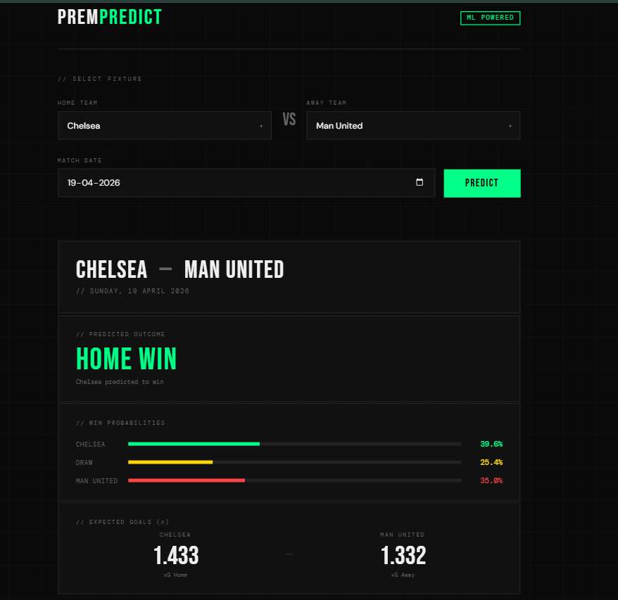

# PremPredict — EPL Match Prediction Model
 
A machine learning system that predicts English Premier League match outcomes using Poisson Regression. Given any two EPL teams, it returns win probabilities for all three outcomes (Home Win / Draw / Away Win) along with expected goals for each team.
 
Built with a full data pipeline, REST API, and web frontend.
 
---
 
## Demo
 

 
---
 
## How It Works
 
1. **Data** — Historical EPL match data (2010–2025) sourced from [football-data.co.uk](https://www.football-data.co.uk)
2. **Features** — Rolling form statistics (last 5 games), venue-split home/away stats, Elo ratings, shots on target, clean sheets, cumulative goal averages
3. **Model** — Two separate Poisson Regressors trained on home and away goals. Outputs λ_home and λ_away (expected goals), which are fed into a probability matrix to compute P(Home Win), P(Draw), P(Away Win)
4. **API** — FastAPI endpoint accepts home team, away team, and date — computes features on the fly and returns predictions
5. **Frontend** — Single page HTML/CSS/JS interface
---
 
## Model Performance
 
Evaluated using TimeSeriesSplit (5 folds) to prevent data leakage:
 
| Metric | Value |
|---|---|
| Overall Accuracy | 54.5% |
| H/A Only Accuracy (draws excluded) | 72.8% |
| Baseline (always predict Home Win) | 45.2% |
| Avg MAE — Home Goals | 0.979 |
| Avg MAE — Away Goals | 0.879 |
| Balanced Accuracy | 0.456 |
 
Draw prediction is a known limitation of standard Poisson models — home advantage causes P(H) to dominate the argmax. The H/A accuracy of 72.8% reflects the model's genuine ability to identify the winning team when a draw is not the outcome.
 
---
 
## Project Structure
 
```
prem_model/
├── processing/               # Data pipeline scripts
│   ├── download_data.py      # Fetches historical EPL data from football-data.co.uk
│   ├── compute_elo.py        # Calculates Elo ratings for all teams
│   ├── pre_rolling.py        # Builds team-level match rows with venue split
│   ├── rolling_features.py   # Computes rolling window statistics
│   └── build_match_dataset.py # Assembles final feature dataset
├── processing_API/           # Update pipeline scripts
│   ├── update_data.py        # Fetches new matches since last update
│   └── update_elo.py         # Recomputes Elo and saves current ratings
├── src/                      # Model training and API
│   ├── poisson_prediction.py # Model training, evaluation, and saving
│   └── api.py                # FastAPI prediction endpoint
├── models/                   # Saved model files (generated, not tracked)
├── data/                     # Data files (generated, not tracked)
├── index.html                # Web frontend
├── update_pipeline.py        # Orchestrates full data + model update
└── requirements.txt
```
 
---
 
## Setup
 
### Prerequisites
- Python 3.9+
- Git
### Installation
 
```bash
git clone https://github.com/Paulo-Pereira346/premier-league-prediction-model
cd premier-league-prediction-model
python -m venv venv
source venv/bin/activate  # Windows: venv\Scripts\activate
pip install -r requirements.txt
```
 
### Build the dataset from scratch
 
```bash
python -m processing.download_data
python -m processing.compute_elo
python -m processing.pre_rolling
python -m processing.rolling_features
python -m processing.build_match_dataset
```
 
### Train and save the model
 
```bash
python -m src.poisson_prediction
```
 
### Run the API
 
```bash
uvicorn src.api:app --reload
```
 
API will be available at `http://localhost:8000`
 
### Open the frontend
 
Open `index.html` in your browser while the API is running.
 
---
 
## API Endpoints
 
### `GET /predict`
 
Returns match outcome prediction for a given fixture.
 
**Parameters:**
| Param | Type | Example |
|---|---|---|
| home | string | Arsenal |
| away | string | Chelsea |
| date | string (YYYY-MM-DD) | 2026-04-19 |
 
**Example request:**
```
GET /predict?home=Arsenal&away=Chelsea&date=2026-04-19
```
 
**Example response:**
```json
{
  "lambda_home": 2.07,
  "lambda_away": 1.21,
  "prediction": "H",
  "probabilities": {
    "home_win": 0.551,
    "draw": 0.228,
    "away_win": 0.221
  }
}
```
 
### `GET /teams`
 
Returns the list of all valid team names.
 
---
 
## Updating with New Match Data
 
After each gameweek, run the update pipeline to fetch new results and retrain:
 
```bash
python update_pipeline.py
```
 
This automatically fetches new matches, recomputes Elo ratings, rebuilds rolling features, and retrains the model.
 
---
 
## Tech Stack
 
- **Python** — pandas, numpy, scikit-learn, scipy
- **Model** — Poisson Regression (scikit-learn) with probability matrix outcome prediction
- **API** — FastAPI + uvicorn
- **Frontend** — HTML, CSS, JavaScript (no frameworks)
- **Data** — football-data.co.uk
---
 
## Key Design Decisions
 
**Why Poisson Regression?** Goals in football follow a Poisson distribution naturally. Training separate models for home and away goals allows the probability of all three outcomes to be derived mathematically from the predicted lambdas.
 
**Why venue-split features?** A team's home form and away form are fundamentally different. Arsenal scoring 2.1 goals per home game vs 1.3 per away game is more informative than a blended 1.7 average.
 
**Why TimeSeriesSplit?** Standard cross-validation shuffles data randomly, causing data leakage for time-series data. TimeSeriesSplit ensures training data is always chronologically earlier than test data.
 
---
 
## Limitations
 
- Draw prediction is weak — standard Poisson models systematically underpredict draws due to home advantage dominating the probability argmax
- Predictions reflect form up to the last pipeline run — run `update_pipeline.py` after each gameweek for current predictions
- No player-level data — injuries, suspensions, and squad rotations are not accounted for
---
 
## Author
 
Paulo Pereira — Third year Computer Science Engineering student at Padre Conceição College of Engineering, Goa.

